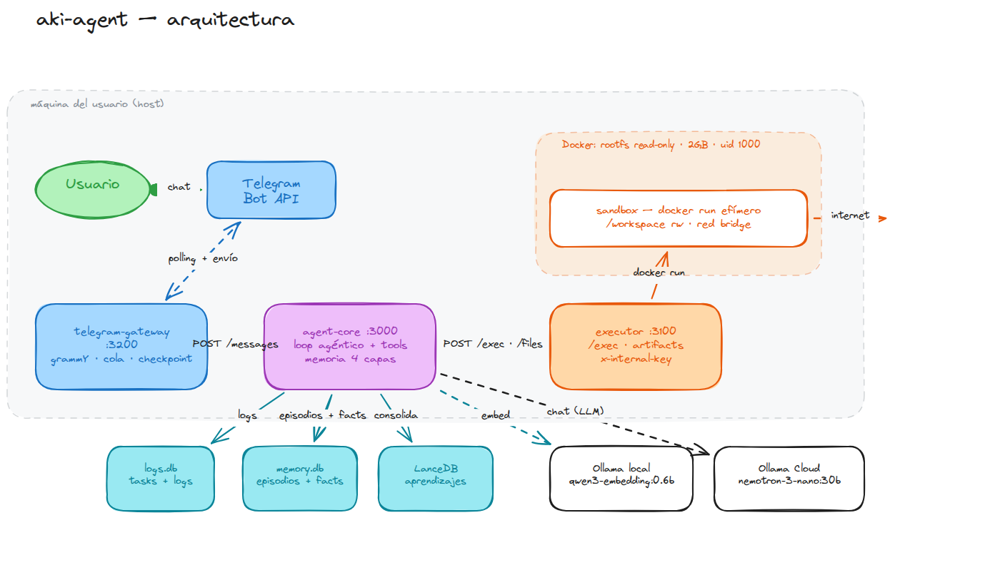

# aki-agent

[](https://nodejs.org/)
[](https://pnpm.io/)
[](https://www.docker.com/)
[](LICENSE)

> Agente de inteligencia artificial autónomo que corre en tu propia máquina. Atiende por Telegram, razona con un LLM a través de **Ollama Cloud** y ejecuta acciones reales (comandos, scripts, npm, pip) dentro de un **sandbox Docker aislado**.



## Tabla de contenidos

- [Qué es](#qu%C3%A9-es)
- [Arquitectura](#arquitectura)
- [Características principales](#caracter%C3%ADsticas-principales)
- [Requisitos](#requisitos)
- [Instalación rápida](#instalaci%C3%B3n-r%C3%A1pida)
- [Configuración](#configuraci%C3%B3n)
- [Uso](#uso)
- [Seguridad](#seguridad)
- [Desarrollo](#desarrollo)
- [Diagnóstico](#diagn%C3%B3stico)
- [Licencia](#licencia)

## Qué es

`aki-agent` es un asistente personal de IA modular y autocontenido:

- Recibe mensajes de Telegram.
- Interpreta la solicitud y decide qué hacer.
- Ejecuta código, instala dependencias, genera archivos y consulta datos dentro de un sandbox.
- Responde con texto y, cuando corresponde, entrega archivos directamente en el chat.
- Aprende entre tareas mediante un sistema de memoria en capas.

Todo corre localmente bajo tu control: el LLM remoto se usa solo para el razonamiento, mientras que la ejecución, los datos y la memoria permanecen en tu equipo.

## Arquitectura

El proyecto es un monorepo organizado con **pnpm workspaces**.

| Paquete | Ruta | Responsabilidad |
| --- | --- | --- |
| `@aki/telegram-gateway` | `packages/telegram-gateway` | Bot de Telegram (grammY), cola persistente, checkpoint de updates y entrega de resultados + archivos. |
| `@aki/agent-core` | `packages/agent-core` | Loop agéntico con Ollama Cloud, sistema de tools propio sin SDKs, memoria en capas y consolidación de aprendizajes. |
| `@aki/executor` | `packages/executor` | Sandbox de ejecución: Docker endurecido o proceso en host, artifacts vía HTTP. |
| `@aki/event-manager` | `packages/event-manager` | Reservado para contratos compartidos entre gateway y agent-core (hoy vacío). |

Flujo típico:

1. Telegram entrega el mensaje al `telegram-gateway`.
2. El gateway encola el mensaje y lo envía a `agent-core`.
3. `agent-core` razona con el modelo y, si es necesario, invoca tools que llaman a `executor`.
4. Al finalizar, `agent-core` notifica al gateway, que responde al usuario por Telegram.

## Características principales

- **Sistema de tools propio** (`packages/agent-core/src/tools.ts`): definiciones declarativas con schemas Zod, serializadas automáticamente a JSON Schema para Ollama. Sin dependencias de frameworks de agentes.
- **Loop agéntico con continuación**: hasta `AGENT_MAX_TOOL_ROUNDS` (15) por segmento y hasta `AGENT_MAX_SEGMENTS` (3) de continuación. Si el modelo sigue necesitando tools al agotar un segmento, se notifica progreso al usuario y se retoma automáticamente con el contexto y el scratchpad actualizado.
- **Memoria en capas**:
  - **Capa 0** — `constitution.md`: reglas base inyectadas al system prompt (solo lectura para el agente).
  - **Capa 1** — scratchpad por tarea (`workspace/.agent/scratchpad.md`): notas efímeras que se reinyectan al continuar.
  - **Capa 2** — episodios en SQLite (`memory.db`): historial append-only de acciones y observaciones.
  - **Capa 3** — aprendizajes semánticos en LanceDB + embeddings locales (Ollama local, por defecto `qwen3-embedding:0.6b`, 1024 dims): el agente propone, la consolidación decide con dedupe por similitud coseno y TTL de 30 días.
  - **Capa 4** — hechos versionados: nunca se pisa un valor sin dejar rastro en `facts_history`.
- **Sandbox Docker endurecido** (`packages/executor`): rootfs read-only, `/tmp` como tmpfs noexec/nosuid, sin capabilities adicionales, límite de RAM/PIDs, usuario no privilegiado (uid 1000), denylist de binarios, anti-traversal léxico y verificación con `realpath` contra symlinks.
- **Gateway robusto**: bind en loopback, allowlist de usuarios de Telegram, auth inter-servicios por shared secret y descarte opcional del backlog al arrancar.
- **Cola persistente** de mensajes y checkpoint de `update_id`, para no reprocesar tras reinicio.

## Requisitos

- **Node.js** >= 22.5 (usa `node:sqlite` nativo)
- **pnpm** >= 10.17.1
- **Docker** (para ejecutar el sandbox en modo recomendado)
- Cuenta en [Ollama Cloud](https://ollama.com) con una API key
- **Ollama local** para embeddings (modelo por defecto: `qwen3-embedding:0.6b`)
- Un bot de Telegram creado con [@BotFather](https://t.me/BotFather)

## Instalación rápida

```bash
git clone https://github.com/beresiartejuan/aki-assistant-ai.git
cd aki-assistant-ai
pnpm install
```

### 1. Crear los archivos de entorno

Cada paquete carga su propio `.env` desde su directorio de trabajo. Creá los tres archivos con las variables que se detallan más abajo:

```bash
touch packages/agent-core/.env
touch packages/executor/.env
touch packages/telegram-gateway/.env
```

Las **cuatro variables imprescindibles** son:

| Variable | Archivo `.env` | Cómo obtenerla |
| --- | --- | --- |
| `OLLAMA_API_KEY` | `packages/agent-core/.env` | [ollama.com → Settings → Keys](https://ollama.com/settings/keys) |
| `TELEGRAM_BOT_TOKEN` | `packages/telegram-gateway/.env` | @BotFather en Telegram |
| `ALLOWED_TELEGRAM_USER_IDS` | `packages/telegram-gateway/.env` | Tu id numérico de Telegram ([@userinfobot](https://t.me/userinfobot)) |
| `INTERNAL_API_KEY` | **los tres** `.env` | Generar una sola vez, por ejemplo: `openssl rand -hex 32` |

> ⚠️ Si no definís `ALLOWED_TELEGRAM_USER_IDS`, el bot aceptará mensajes de cualquier usuario. En producción siempre configurá la allowlist.

### 2. Construir la imagen del sandbox

```bash
docker build -f packages/executor/docker/sandbox.Dockerfile -t aki-sandbox:latest packages/executor/docker/
```

### 3. Descargar el modelo de embeddings local

```bash
ollama pull qwen3-embedding:0.6b
```

### 4. Levantar los servicios

En tres terminales separadas, en este orden:

```bash
# Terminal 1 — sandbox de ejecución (puerto 3100)
pnpm --filter @aki/executor dev

# Terminal 2 — cerebro del agente (puerto 3000)
pnpm --filter @aki/agent-core dev

# Terminal 3 — gateway de Telegram (puerto 3200)
pnpm --filter @aki/telegram-gateway dev
```

Ahora podés escribirle al bot por Telegram y el agente responderá desde tu máquina.

## Configuración

A continuación se listan las variables de entorno disponibles por paquete. Los valores marcados con *(obligatorio)* deben configurarse para que el sistema funcione correctamente.

### `packages/agent-core/.env`

| Variable | Default | Descripción |
| --- | --- | --- |
| `OLLAMA_API_KEY` | *(obligatorio)* | API key de Ollama Cloud. |
| `OLLAMA_BASE_URL` | `https://ollama.com` | Endpoint de la API de chat. |
| `OLLAMA_MODEL` | `nemotron-3-nano:30b` | Modelo principal de razonamiento. |
| `GATEWAY_URL` | `http://localhost:3200` | URL del gateway para notificar resultados. |
| `EXECUTOR_URL` | `http://localhost:3100` | URL del executor para ejecutar tools. |
| `AGENT_MAX_TOOL_ROUNDS` | `15` | Rondas máximas modelo↔tools por segmento. |
| `AGENT_MAX_SEGMENTS` | `3` | Segmentos de continuación automática. |
| `OLLAMA_LOCAL_URL` | `http://127.0.0.1:11434` | Ollama local para embeddings. |
| `OLLAMA_EMBED_MODEL` | `qwen3-embedding:0.6b` | Modelo de embeddings local. |
| `OLLAMA_EMBED_DIM` | `1024` | Dimensión de los vectores de embeddings. |
| `MEMORY_TTL_DAYS` | `30` | TTL de aprendizajes semánticos. |
| `MEMORY_EPISODES_IN_CONTEXT` | `8` | Episodios previos inyectados al prompt. |
| `MEMORY_SEMANTIC_TOP_K` | `5` | Aprendizajes semánticos más relevantes inyectados. |
| `MEMORY_FACTS_IN_CONTEXT` | `30` | Máximo de hechos inyectados al prompt. |
| `BIND_HOST` | `127.0.0.1` | Interfaz de bind del servidor HTTP. |
| `INTERNAL_API_KEY` | *(vacío)* | Shared secret para auth entre servicios. |

### `packages/executor/.env`

| Variable | Default | Descripción |
| --- | --- | --- |
| `EXECUTOR_SANDBOX_MODE` | `docker` | `docker` (recomendado) o `process` (host, solo desarrollo). |
| `EXECUTOR_DATA_DIR` | `data/sandbox` | Directorio raíz de workspaces por tarea. |
| `EXECUTOR_SANDBOX_IMAGE` | `aki-sandbox:latest` | Imagen Docker del sandbox. |
| `EXECUTOR_NETWORK_MODE` | `bridge` | Modo de red del contenedor: `none`, `bridge` o `host`. |
| `EXECUTOR_CONTAINER_MEMORY` | `2GB` | Límite de RAM por contenedor. |
| `EXECUTOR_CONTAINER_CPUS` | `0` | Límite de CPUs (0 = sin límite). |
| `EXECUTOR_DEFAULT_TIMEOUT_MS` | `15000` | Timeout por defecto de un comando. |
| `EXECUTOR_MAX_TIMEOUT_MS` | `120000` | Timeout máximo permitido por request. |
| `EXECUTOR_MAX_OUTPUT_CHARS` | `10000` | Máximo de caracteres de stdout+stderr devueltos. |
| `EXECUTOR_MAX_CONCURRENT` | `4` | Máximo de comandos simultáneos. |
| `BIND_HOST` | `127.0.0.1` | Interfaz de bind del servidor HTTP. |
| `INTERNAL_API_KEY` | *(vacío)* | Shared secret para auth entre servicios. |

### `packages/telegram-gateway/.env`

| Variable | Default | Descripción |
| --- | --- | --- |
| `TELEGRAM_BOT_TOKEN` | *(obligatorio)* | Token de @BotFather. |
| `AGENT_CORE_URL` | `http://localhost:3000` | URL del servidor HTTP de agent-core. |
| `EXECUTOR_URL` | `http://localhost:3100` | URL del executor (descarga de artifacts). |
| `GATEWAY_PORT` | `3200` | Puerto del servidor de resultados. |
| `GATEWAY_SKIP_BACKLOG` | `true` | Descarta mensajes acumulados al arrancar. |
| `ALLOWED_TELEGRAM_USER_IDS` | *(vacío)* | IDs de Telegram permitidos, separados por coma. |
| `GATEWAY_DATA_DIR` | `data` | Directorio de persistencia de la cola y checkpoint. |
| `GATEWAY_DISPATCH_POLL_MS` | `1000` | Intervalo de sondeo del dispatcher. |
| `GATEWAY_MAX_BACKOFF_MS` | `30000` | Backoff máximo entre reintentos. |
| `GATEWAY_ARTIFACTS_DIR` | `../executor/data/sandbox` | Base de workspaces del executor (para mensajes con ruta local). |
| `BIND_HOST` | `127.0.0.1` | Interfaz de bind del servidor HTTP. |
| `INTERNAL_API_KEY` | *(vacío)* | Shared secret para auth entre servicios. |

## Uso

Mandá un mensaje de texto a tu bot por Telegram. Algunos ejemplos de lo que puede hacer:

- Responder preguntas generales usando el modelo de razonamiento.
- Ejecutar scripts de Node.js o Python en el sandbox.
- Instalar paquetes npm/pip dentro del workspace de una tarea.
- Generar archivos (informes, imágenes, CSVs, etc.) y entregarlos por Telegram.
- Recordar preferencias y hechos entre conversaciones usando la memoria en capas.

Para que un archivo generado llegue al chat, el agente debe marcarlo explícitamente con la tool `deliver_file`. Los archivos de trabajo interno no se envían por defecto.

## Seguridad

- **Comunicación interna**: los tres servicios HTTP bindean a `127.0.0.1` por defecto y se autentican entre sí mediante `INTERNAL_API_KEY` (header `x-internal-key`). Los endpoints `GET /status` permanecen abiertos para health-checks.
- **Allowlist de usuarios**: el gateway solo procesa mensajes de los IDs de Telegram configurados. Los mensajes de usuarios desconocidos se ignoran y se registran en el log.
- **Sandbox aislado** (modo `docker`):
  - rootfs read-only,
  - `/tmp` como tmpfs `noexec,nosuid`,
  - `--cap-drop ALL`,
  - límite de RAM y PIDs,
  - usuario no privilegiado (uid 1000),
  - denylists de binarios y argumentos,
  - anti-traversal léxico + validación `realpath` para evitar escapes por symlink.
- **Modo `process`**: ejecución directa en el host, pensada solo para desarrollo sin Docker. En este modo se aplican restricciones adicionales: no se permiten intérpretes con ejecución inline ni comandos con ruta absoluta.
- **Memoria fuera del sandbox**: episodios, aprendizajes y hechos viven en SQLite/LanceDB del host, inaccesibles desde el sandbox por diseño.

> Si vas a exponer el agente más allá de tu máquina local, colocá los servicios detrás de un proxy o VPN y configurá `INTERNAL_API_KEY` obligatorio en los tres paquetes.

## Desarrollo

Verificá tipos y compilación de todo el monorepo:

```bash
pnpm typecheck
pnpm build
```

El repositorio todavía no incluye una suite de tests automatizados; los flujos se validan con pruebas manuales end-to-end.

La CI (`./.github/workflows/ci.yml`) ejecuta `pnpm install --frozen-lockfile`, `pnpm typecheck` y `pnpm build` sobre Node.js 24.

### Estructura del código

- `packages/agent-core/src/state.ts` — loop agéntico y orquestación de tareas.
- `packages/agent-core/src/tools.ts` — registro y ejecución de tools.
- `packages/agent-core/src/builtin-tools.ts` — tools integradas (`run_command`, `shell`, `deliver_file`, memoria, etc.).
- `packages/agent-core/src/memory*.ts` + `semantic.ts` + `consolidate.ts` — capas de memoria.
- `packages/executor/src/security.ts` + `runner.ts` — sandbox y ejecución de comandos.
- `packages/telegram-gateway/src/telegram.ts` + `dispatcher.ts` + `queue.ts` — bot, cola y entrega de resultados.

## Diagnóstico

Cada servicio escribe logs a stdout. Además, `agent-core` mantiene dos bases SQLite bajo `packages/agent-core/data/`:

- `logs.db` — tablas `logs` y `tasks` con estado, tokens y rondas por tarea.
- `memory.db` — tablas `episodes`, `facts`, `facts_history` y `memory_candidates`.

Los workspaces de cada tarea se encuentran en `packages/executor/data/sandbox/<taskId>/`.

## Licencia

MIT — ver [LICENSE](LICENSE).
